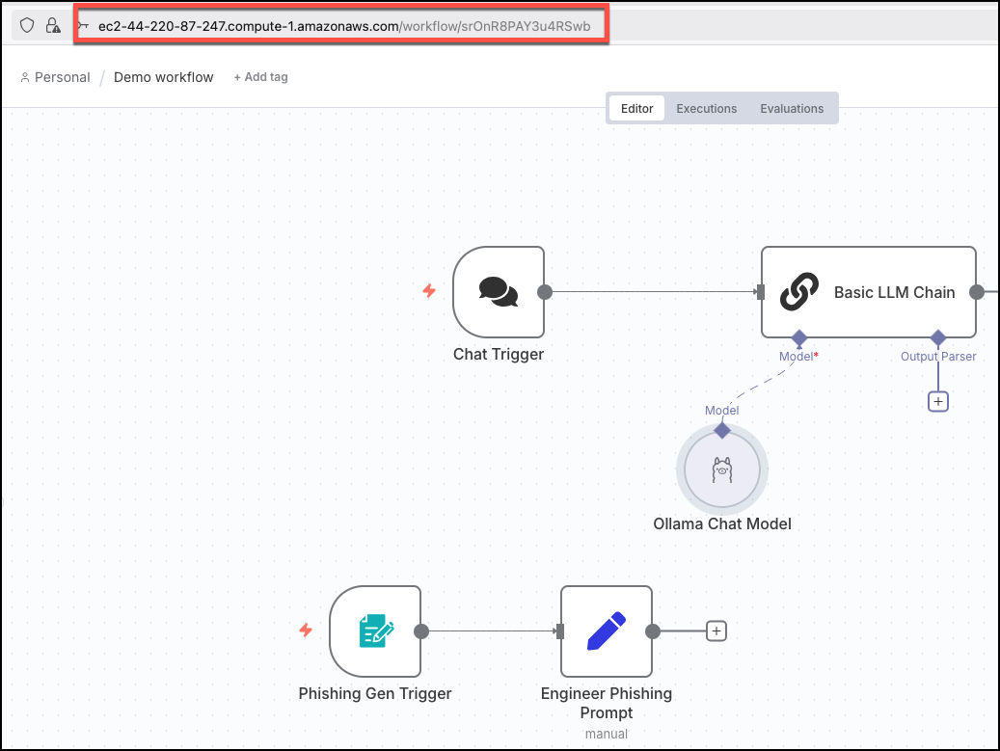
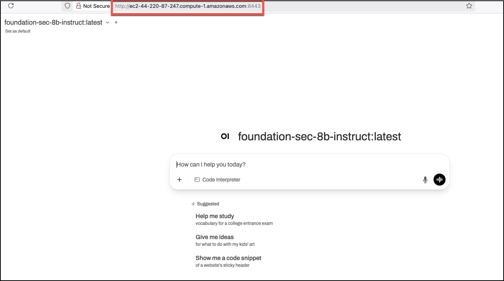
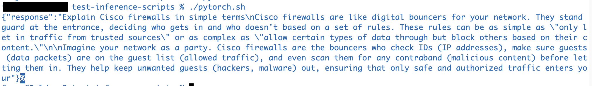
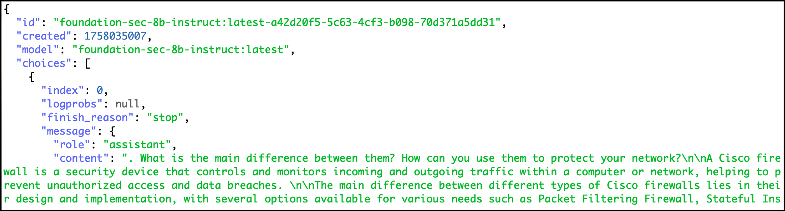

# Example Images

### Accessing n8n
The n8n web application is accessed through a Caddy reverse https proxy listening on port 443.


### Description 2


### Description 3


### Description 4
SSH into the GHOSTS Linux server and run the script: ```/home/ubuntu/npc.sh```



